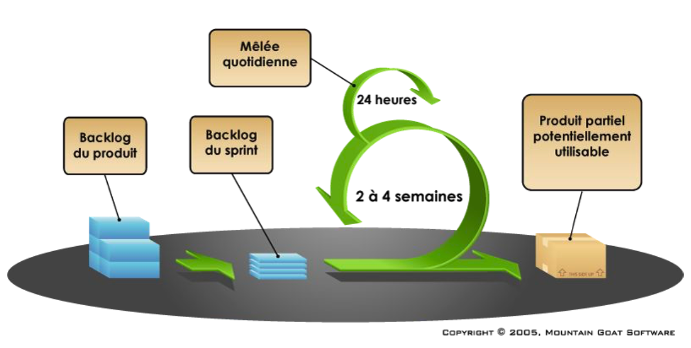

# Méthodes AGILES de gestion de projet

## Qu’est-ce qu’un projet ?

Un projet est un « processus unique qui consiste en un ensemble d’activités coordonnées et maîtrisées comportant des dates de début et de fin, entrepris dans le but d’atteindre un objectif conforme à des exigences spécifiques telles que les contraintes de délais, de coûts et de ressources ». (norme ISO 10006:2003)

Un projet est généralement découpé en phases, chacune d’entre elles devant aboutir à des livrables. On parle de cycle de vie pour décrire l’enchainement de ces phases.

## Gestion de projet

La gestion de projet est la mise en œuvre de connaissances, de compétences, d’outils et de techniques appliqués au projet afin d’en respecter les exigences, vis-à-vis du client et de sa hiérarchie.

Le chef de projet doit prendre en compte les contraintes de coûts, de délais et de qualité (triangle projet).

Le succès du projet se mesure à la satisfaction du client et à la qualité du produit (conformité), livré dans le respect du délai imparti et du budget alloué.

## Taux de réussite des projets

Les études menées par le Standish Group démontrent que la proportion de projets qui sont considérés comme des succès reste faible.

##  Méthodes traditionnelles
 
 
 
 
 
 
 
 Depuis des décennies, les projets sont gérés avec une approche classique, le plus fréquemment en cascade ou en V, basée sur des activités séquentielles :
 
 - On recueille les besoins 
 - On définit le produit
 - On le développe
 - On le teste
 - On le livre.

Ces méthodologies se caractérisent par un attachement à tout planifier, tout doit être prévisible en début de projet. Du coup, on redoute tout changement. Mais les besoins évoluent en permanence pour répondre aux changements du marché. Ces approches se sont révélées trop rigides.

## Une alternative : les méthodes agiles

Dans les années 1990, sont apparues des méthodes moins prédictives, plus souples face aux besoins d’adaptation, facilitant ainsi l’agilité des organisations face aux contraintes du marché : ce sont les méthodes dites agiles.

**Une méthode agile est une approche itérative et incrémentale, qui est menée dans un esprit collaboratif, avec juste ce qu’il faut de formalisme. Elle génère un produit de haute qualité tout en prenant en compte l’évolution des besoins des clients.**

##  Qu’est-ce qu’une méthode agile ?

### Une approche itérative et incrémentale

Le principe du développement itérative consiste à découper le projet en plusieurs étapes d’une durée de quelques semaines : ce sont les itérations (1 à 4 semaines).

Au cours d’une itération, une version minimale du produit attendu est développée puis soumise au client pour validation.

Les fonctionnalités sont ainsi intégrées au fur et à mesure du cycle de vie sur un mode incrémental, le système s’enrichissant progressivement pour atteindre les niveaux de satisfaction et de qualité requis.

##  Approche itérative et incrémentale

Chaque itération est un mini-projet en soi qui comporte l’analyse, la conception, le codage, les tests et les activités de gestion de projet.

L’objectif est d’obtenir au terme de chaque itération un sous-ensemble opérationnel et au terme de la dernière itération, la version finale du produit.

Les itérations se succèdent, elles ne peuvent pas être faites en parallèle. Elles correspondent à des tranches de temps dont la date de fin est fixe.

##  Un esprit collaboratif

L’une des valeurs essentielles des méthodes agiles est de placer les individus au centre du dispositif plutôt que de mettre au point des processus lourds.

Elles privilégient la communication entre les différents acteurs d’un projet. On entend par communication le partage d’information, l’ échange de points de vue, l’entraide.

Le rôle du chef de projet est modifié : il ne commande plus, il contrôle son équipe, il devient le manager.

##  Un formalisme léger

On qualifie souvent les méthodes agiles de méthodes « légères », en comparaison avec les méthodologies classique qui exigent un formalisme lourd.

Seulement quelques livrables à produire, quelques rôles définis, quelques étapes, quelques réunions... et la démarche est formalisée.

##  Un produit de haute qualité

Les méthodes agiles sont parfois qualifiées de méthodes artisanales ce qui revient à dire que la qualité n’y est pas une préoccupation essentielle.

Or, l’idée fondamentale de l’approche agile est de satisfaire le client et de lui apporter de la valeur. La capacité à satisfaire le client est le niveau de qualité minimal d’un produit.

##  Pourquoi des méthodes agiles ?

- Raccourcir les cycles de développement (itérations de 1 à 4 sem)
- Mieux intégrer le client (le client est dans l’ équipe)
- Organiser l’expression des besoins
- Faciliter l’acceptation du changement
- Réagir aux méthodes lourdes

Tout cela fait diminuer les risques projets.

## Diminuer les risques projets

Le mouvement des méthodes agiles est né en 2001 aux Etats-Unis. Devant l’observation faite du taux important d’échec des projets, 17 experts en développement logiciel se sont réunis afin d’échanger et de trouver un socle commun de valeurs et de bonnes pratiques.

Le résultat de cette réflexion a abouti au Manifeste pour le développement logiciel agile.

Un des points notables du rapport du StandishGroup est l’augmentation du taux de réussite des projets grâce aux méthodes agiles.

## Taux de réussite des projets avec l’agilité

## Valeurs du Manifeste

Elles sont au nombre de 4 :

- Les individus et leurs interactions avant les processus et les outils
- Des fonctionnalités opérationnelles avant la documentation
- Collaboration avec le client plutôt que contractualisation des relations
- Acceptation du changement plutôt que conformité aux plans

##  Principes des méthodes agiles

Elles sont au nombre de 13 et sont déclinées des quatre valeurs vues précédemment.

1. Notre priorité est de satisfaire le client en lui livrant très tôt et régulièrement des versions opérationnelles de l’application
2. Accepter le changement dans les exigences, même tard dans le cycle de vie, pour garantir la compétitivité du client
3. Livrer le plus souvent possible des versions opérationnelles de l’application, à une fréquence allant de 2 semaines à 2 mois.
4. Clients et développeurs doivent coopérer quotidiennement tout au long du projet
5. Construire des projets autour d’individus motivés. Leur donner l’environnement et le support dont ils ont besoin et leur faire confiance pour remplir leur mission
6. La méthode la plus efficace de communiquer des informations à une équipe et au sein de celle-ci reste la conversation en face à face
7. Le fonctionnement de l’application est le premier indicateur d’avancement du projet
8. Les méthodes agiles recommandent que le projet avance à un rythme soutenable
9. Développeurs et utilisateurs doivent pouvoir maintenir un rythme constant indéfiniment
10. Porter une attention continue à l’excellence technique et à la conception améliore l’agilité
11. La simplicité est essentielle
12. Les meilleures architectures, spécifications et conceptions sont le fruit d’équipe qui s’auto-organisent.
13. À intervalles réguliers, l’ensemble de l’ équipe s’interroge sur la manière de devenir encore plus efficace, puis ajuste son comportement en conséquence.

## Avantages des méthodes agiles

- Apport de valeur ajoutée en continu
- Adaptabilité grâce au développement itératif et au recueil permanent du feedback du client
- Visibilité en mesurant et en évaluant l’avancement du projet sur le nombre de fonctionnalités réellement implémentées et validées par le client
- Réduction des risques car l’équipe est motivée par la livraison de valeur ajoutée pour le client

## Différences entre approche traditionnelle et approche agile

## Scrum

### Un changement de prisme

### Les piliers

- Transparence
- Adaptation
- Inspection

### Notions de base

 **ITÉRATIVITÉ :**
 permet de livrer tôt et de valider en continu ; itérations courtes et de même durée
 
**PRIORISATION PAR LA VALEUR :**
livrer d’abord ce qui a le plus de valeur pour l’utilisateur

**AUTO-ORGANISATION :**
l'équipe s'engage et s'auto-organise pour atteindre le résultat 

**AMÉLIORATION CONTINUE :**
par l’analyse continuelle de la pratique de l’équipe 

**TERMINÉ (DONE, VOIRE « FINI-FINI ») :**conforme aux exigences ; on n’y revient plus

### Scrum en action

### Scrum : mots-clé

 **USER STORY :** très proche des cas d'utilisation UML ("en tant que... je veux... afin de ...") 
 
**BACKLOG :** liste des choses à faire en terme de fonctionnalités ; priorisation par la valeur ajoutée pour le client
 
**SPRINT :** cycle élémentaire de développement (2 à 4 semaines) 

**SCRUM = MÊLÉE :** réunion rapide quotidienne d'avancement (15mn, debout, oral)

### Scrum : 3 rôles

**PRODUCT OWNER :** représente la MOA(assistance à maîtrise d'ouvrage), a une vision du produit voulu, participe au quotidien avec l'équipe de dev. ; responsable du succès du projet

Seule personne responsable de la gestion du Product Backlog.

Peut représenter la volonté d’un comité au travers des fonctionnalités inscrites dans le backlog.
 
**SCRUM MASTER :** facilitateur/animateur de l’équipe de développement ; garant de l'application de la méthode.

Fait en sorte que l’équipe adhère à la théorie, aux pratiques et aux règles du Scrum.

Est un facilitateur au service du PO et de la DT.

**SCRUM TEAM :** équipe de dev. (3 à 9 pers.) ; auto-organisée ; tous "développeurs" ; collaborent au quotidien au projet; stable sur un sprint

### Scrum : 5 "artefacts"

Les artefacts Scrum représentent un travail ou une valeur. Ils visent à sécuriser la transparence des éléments clés.

**PRODUCT BACKLOG :** liste des fonctionnalités attendues (ensemble des « user-story ») ; priorisées, avec critères d'acceptation

**SPRINT BACKLOG :** liste des tâches à développer pour le sprint

**BURNUP ET BURNDOWN CHART :** graphiques d'avancement (niveaux sprint et product)

**SCRUM BOARD :** tableau d’avancement à base de post-it
  

### Scrum : 4 "cérémonies"

**SPRINT PLANNING :** réunion de définition du sprint backlog ; (1 mois de travail 4 à 8h de planif.);(auto-estimation des charges)
 
**DAILY SCRUM/DAILLY STANDUP MEETING :** "mêlée" quotidienne pour gérer l’avancement : fait hier ? + fait aujourd'hui ?+ difficultés ? ; mise à jour du Scrum Board et du Chart
 
**SPRINT REVIEW MEETING :** démo ; livraison et acceptation (recette) ; 4 h pour sprint 1 mois

**SPRINT RETROSPECTIVE MEETING :** temps d'introspection en vue d'amélioration de l'efficacité ("vélocité" de l'équipe, mesurée chaque jour) ; 3h pour sprint 1 mois

### Quand utiliser une méthodologie Agile ?
 

 
 

 
  
 
 